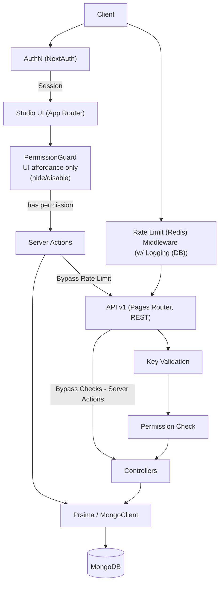
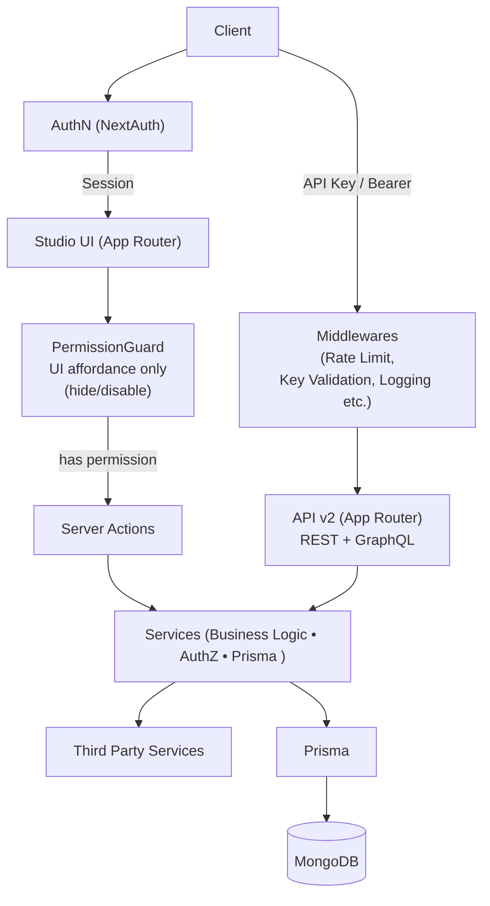

# Project Overview

Simpl:API is a headless CMS that offers flexible content modeling, allowing you to create custom structured data types
and content within those types to gather data from your applications and services, as well as to process, visualize, and
display it in your applications and services. It uses TypeScript/Next.js for both the frontend and backend.

## Key Principles

- **Type Safety**: TypeScript is used throughout to ensure maintainability and reduce runtime errors.
- **Separation of Concerns**: Logic is divided between controllers, components, and utility libraries.
- **Database First**: Prisma is used for schema management and type-safe database access.
- **Testing**: A robust testing suite (Jest and Cypress) ensures code quality and reliability.

## Top-Level Folders (and important sub-folders)

- `app/`: It contains layouts, pages, and forms of the application, uses Next.js app router.
- `pages/`: Only contains api (v1) routes using Next.js pages router, but will be migrated to app router in the future.
- `components/`: Reusable React components.
- `controllers/`: Logic for handling API requests.
- `lib/`: Shared utility functions and services.
    - `lib/actions`: Custom actions for server-side logic.
    - `lib/auth`: Authentication and authorization utilities.
    - `lib/handlers`: Custom handlers for server-side logic.
    - `lib/schemas`: Zod schemas for validation.
- `prisma/`: Prisma schema, migrations, and database configuration.
- `hooks/`: Custom React hooks.
- `interfaces/` & `types/`: TypeScript interfaces and type definitions.
- `__tests__/` & `cypress/`: Unit, integration, and end-to-end testing suites.

## Current Architecture Diagram

**Current Architecture is in transition to target architecture. It evolves over time.**

## Target Architecture Diagram

